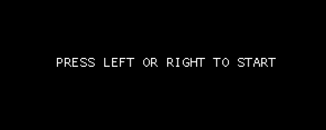
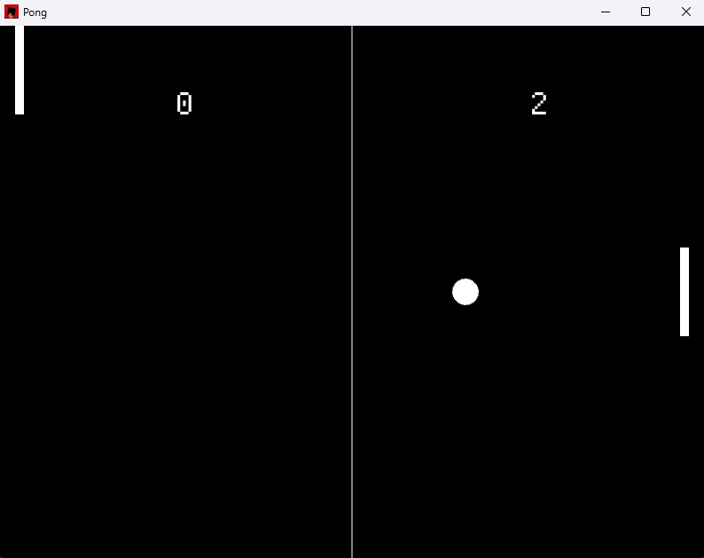

# Pong Game

## Game Setup
* **Players:** 2 .
* **Resolution:** **800x600** window.
* **Winning Condition:** First player to reach **10 points**.

---

## Controls

### Starting the Match
When the game launches, you will see the start screen. You must choose the initial direction of the ball to begin:
* Press **Right Arrow**: Ball starts moving toward the right paddle.
* Press **Left Arrow**: Ball starts moving toward the left paddle.
* 

### Player Movement
| Player | Up Key | Down Key |
| :--- | :--- | :--- |
| **Player 1 (Left)** | **Left Shift** | **Left Control** |
| **Player 2 (Right)** | **Up Arrow** | **Down Arrow** |

---

## Rules & Physics

* **Scoring:** A point is awarded when the ball passes the opponent's paddle and hits the side wall.
* **Wall Bounces:** The ball will bounce off the top and bottom borders of the arena.
* **Paddle Physics:** * The ball reverses horizontal direction upon impact.
    * **Advanced Aiming:** The vertical bounce angle is determined by where the ball hits the paddle. Hitting the edges of the paddle will send the ball flying at a sharper angle compared to hitting the center.
* **Paddle Bounds:** Paddles are restricted to the screen; they cannot move past the top or bottom borders.

---

## How to Run
To compile and launch your game, use the following command in your terminal:
`cargo run` 
To run test part : 
`cargo test`
